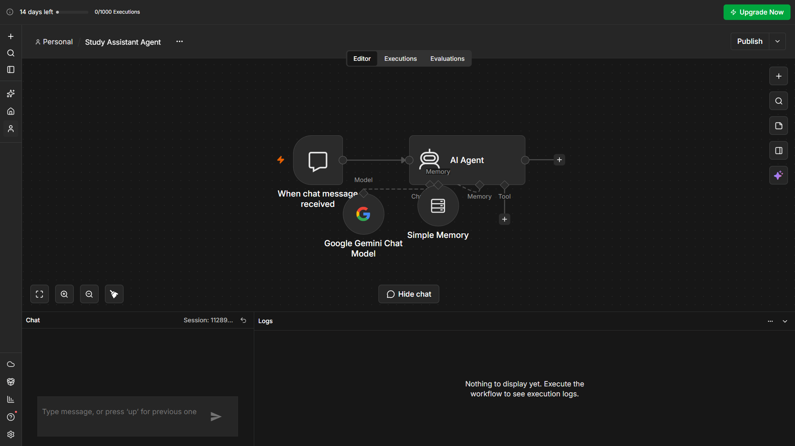
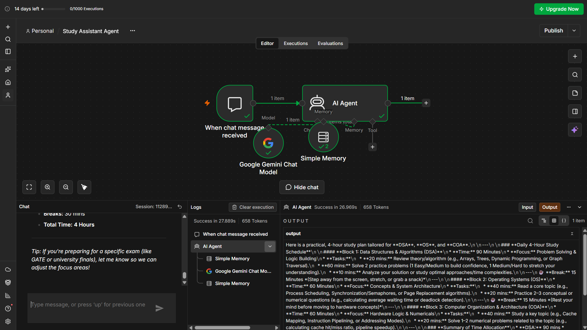

# Study Assistant Agent

An AI-powered Study Assistant Agent built using **n8n and Google Gemini**. It creates personalized daily study plans based on the user's subjects and available time, and automatically reschedules the plan when the available study time changes.

## Features

* Generates personalized daily study plans
* Considers available study time
* Prioritizes important subjects
* Includes study sessions and breaks
* Remembers the current study plan using Simple Memory
* Automatically reschedules the plan when available time changes
* Uses Google Gemini for AI-powered responses

## Technologies Used

* **n8n** – Workflow automation and AI agent platform
* **Google Gemini** – AI language model
* **AI Agent** – Generates and adjusts study plans
* **Simple Memory** – Remembers the current conversation and study plan

## How It Works

The user interacts with the Study Assistant through the n8n Chat Trigger.

The AI Agent receives the user's subjects, available time, priorities, and deadlines and generates a suitable study plan.

Simple Memory allows the agent to remember the current study plan during the conversation. If the user later changes their available time, the agent can modify the existing plan accordingly.

### Workflow

```text
                  ┌──────────────────────┐
                  │   Gemini Chat Model  │
                  └──────────┬───────────┘
                             ↓
┌─────────────────┐    ┌───────────────┐
│  Chat Trigger   │ →  │    AI Agent   │
└─────────────────┘    └───────┬───────┘
                               ↑
                       ┌───────┴───────┐
                       │ Simple Memory │
                       └───────────────┘
```

## Example

### Initial Request

**User:**

> I need to study DSA, Java and Maths. I have 4 hours today.

**AI Agent:**

The agent creates a 4-hour study plan with specific sessions, tasks, and breaks.

### Rescheduling

**User:**

> I only have 1 hour today. Reschedule my previous study plan.

**AI Agent:**

The agent remembers the subjects and creates a new 1-hour plan without exceeding the available time.

Example:

```text
DSA   – 20 minutes
Java  – 15 minutes
Break – 5 minutes
Maths – 20 minutes

Total – 60 minutes
```

## Screenshots

### n8n Workflow



### Study Plan Output



## How to Run

1. Open **n8n**.
2. Import `study-assistant-agent.json`.
3. Create or select your own Google Gemini API credential.
4. Connect the credential to the Google Gemini Chat Model.
5. Open the Chat Trigger.
6. Start a chat with the Study Assistant Agent.
7. Enter your subjects and available study time.

### Sample Inputs

```text
I need to study DSA, Java and Maths. I have 4 hours today.
```

Then test the rescheduling feature:

```text
I only have 1 hour today. Reschedule my previous study plan.
```

## Project Structure

```text
Study-Assistant-Agent/
│
├── README.md
├── study-assistant-agent.json
├── workflow.png
└── study-plan.png
```

## Security Note

The Google Gemini API key should **not** be uploaded to GitHub.

When importing the workflow, users should configure their own Gemini API credential inside n8n.

## Objective

The objective of this project is to demonstrate an AI Agent that can create personalized study schedules and dynamically adapt them when the user's available study time changes.
